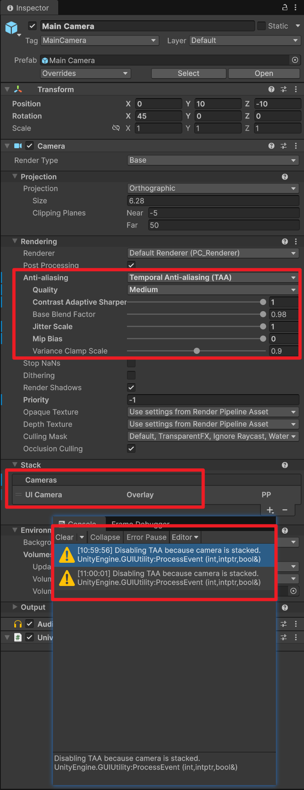
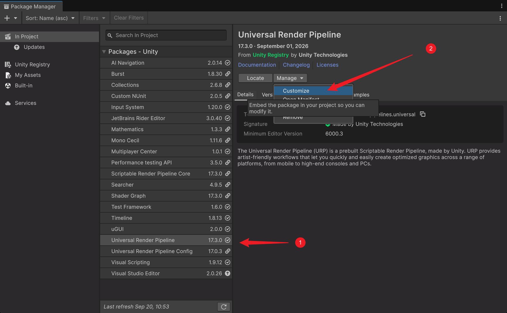

> # 【ShaderLibrary_Unity 6000】


[TOC]

------

# 00 前言


------

# 01 渲染相关

## 1.1 GammaUI


* 所有的UI图片依旧保持sRGB勾选，结果是RGB依然保持原样功能，A通道始终是Gamma

* RenderFeature 中添加GammaUI

* Canvas下复写所有默认的UI材质

* 自定义UIShader自己进行色彩矫正，加到Alpha预乘前面

  ```c#
  #include "Assets/AssetRaw/Shaders/Include/SIH_GammaUI.hlsl"
  
  input.color.rgb = GammaUIEncodeIfActive(input.color.rgb);
  ```
  
  


------
## 1.2 UI 后处理与场景分离


* 添加RenderFeature

  * UI渲染之前定帧>渲染UI>后处理>混合，BeforeRendering，AfterRenderingPostProcessing
  * 混合的模式跟普通的Alpha一样，SrcApha，OneMinusSrcAlpha

* 摄像机设置，后处理设置

  * |                                   | Main Camera | UI Camera |
    | --------------------------------- | ----------- | --------- |
    | Layer（后处理物体右上角的层名称） | Default     | UI        |
    | CullingMask（渲染哪些层）         | 除了UI      | UI        |
    | VolumeMask（后处理应用哪些层）    | Default     | UI        |


------
## 1.3 UI Camera 堆栈启用 TAA

* 如果直接使用TAA会没效果以及弹警告
  

* 将URP Universal包进行本地化，否则只改Library没办法同步其他人电脑
  

* 修改两处源码

  * 将 `TemporalAA.cs` 中的检测警告注释掉

  * ```c#
    internal static string ValidateAndWarn(UniversalCameraData cameraData, bool isSTPRequested = false)
    {
        ...
    
        if (reasonWarning == null && cameraData.cameraTargetDescriptor.msaaSamples != 1)
        {
            if (cameraData.xr != null && cameraData.xr.enabled)
                reasonWarning = "because MSAA is on. MSAA must be disabled globally for all cameras in XR mode.";
            else
                reasonWarning = "because MSAA is on. Turn MSAA off on the camera or current URP Asset.";
        }
    	
        // 注释掉这一段警告Log
        // if(reasonWarning == null && cameraData.camera.TryGetComponent<UniversalAdditionalCameraData>(out var additionalCameraData))
        // {
        //     if (additionalCameraData.renderType == CameraRenderType.Overlay ||
        //         additionalCameraData.cameraStack.Count > 0)
        //     {
        //         reasonWarning = "because camera is stacked.";
        //     }
        // }
    
        if (reasonWarning == null && cameraData.camera.allowDynamicResolution)
            reasonWarning = "because camera has dynamic resolution enabled. You can use a constant render scale instead.";
    
        ...
    }
    
  * 将 `UniversalCameraData.cs` 中的开启规则进行修改，是主相机继续TAA，Overlay相机不继续TAA
  
  
  * ```c#
    internal bool IsTemporalAAEnabled()
    {
        UniversalAdditionalCameraData additionalCameraData;
        camera.TryGetComponent(out additionalCameraData);
    
        return IsTemporalAARequested()          			// Requested
            && postProcessEnabled            			    // Postprocessing Enabled
            && (taaHistory != null)                         // Initialized
            && (cameraTargetDescriptor.msaaSamples == 1)    // No MSAA
            // && !(additionalCameraData?.renderType == CameraRenderType.Overlay || additionalCameraData?.cameraStack.Count > 0)  // No Camera stack
            && additionalCameraData?.renderType != CameraRenderType.Overlay  // 当前Camera不是Overlay类型
            && !camera.allowDynamicResolution               // No Dynamic Resolution
            && renderer.SupportsMotionVectors();     	    // Motion Vectors implemented
    }
  


-----

## 1.4  延迟渲染的修改

### 1.4.1 修改集群着色器为自己的（ClusterDeferred）

* 复制 `ClusterDeferred.shader` 和 `ClusterDeferred.hlsl` 至本地，并在 Shader 中修改引用，之后就只修改 hlsl 文件
* 我存在了 `Assets/Shaders/Deferred` 这个地方，并且文件重命名为
  * `S_StylizedClusterDeferred.shader`
  * `SIH_StylizedClusterDeferred.hlsl`
* 使用  `CustomDeferredSetup.cs` 这个编辑器小工具，将官方的集群着色器改为自己的
  * 在 Project 里选中自己复制出来的 `S_StylizedClusterDeferred.shader`
  * 点击标题栏的 `Tool/CustomDeferred/使用选择的 ClusterDeferred Shader`
  * 修改完成后 git 中的 `UniversalRenderPipelineGlobalSettings.asset` 文件会进行修改，把这个上传，其它同事就会更新到了

### 1.4.2 


------


------


# 10 巨人的肩膀

* UI在线性空间下的Gamma矫正
  * [unity - Rendering transparent UI in Linear Color Space - Game Development Stack Exchange](https://gamedev.stackexchange.com/questions/212135/rendering-transparent-ui-in-linear-color-space)
  * https://cmwdexint.com/2019/05/30/3d-scene-need-linear-but-ui-need-gamma/
* UI后处理与场景后处理分离
  * [Fix UI Post-Processing in Unity! (Finally!) - Render Graph URP Camera Stacking Tutorial (2025)](https://www.youtube.com/watch?v=7_Vy0jDqjvM)
