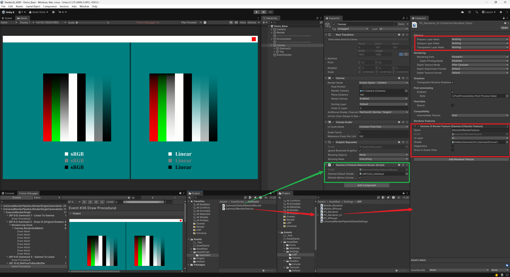

# 【ShaderLibrary_Unity 6000】

[TOC]

------

# 😉约定


------


# 🤡目录

## 渲染相关

### GammaUI



* 所有的UI图片依旧保持sRGB勾选

* RenderFeature 中添加GammaUI

* Canvas下复写所有默认的UI材质

* 自定义UIShader自己进行色彩矫正，加到Alpha预乘前面

  ```c#
  #include "Assets/AssetRaw/Shaders/Include/SIH_GammaUI.hlsl"
  
  input.color.rgb = GammaUIEncodeIfActive(input.color.rgb);
  ```

  


------


------


# 🥰巨人的肩膀

## UI在线性空间下的Gamma矫正

[unity - Rendering transparent UI in Linear Color Space - Game Development Stack Exchange](https://gamedev.stackexchange.com/questions/212135/rendering-transparent-ui-in-linear-color-space)

https://cmwdexint.com/2019/05/30/3d-scene-need-linear-but-ui-need-gamma/
