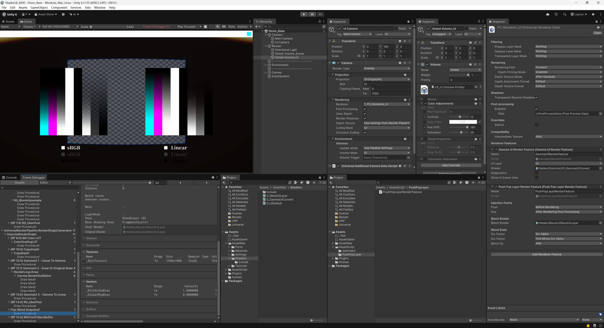

# 【ShaderLibrary_Unity 6000】

[TOC]

------

# 😉约定


------


# 🤡目录

## 渲染相关

### GammaUI


* 所有的UI图片依旧保持sRGB勾选

* RenderFeature 中添加GammaUI

* Canvas下复写所有默认的UI材质

* 自定义UIShader自己进行色彩矫正，加到Alpha预乘前面

  ```c#
  #include "Assets/AssetRaw/Shaders/Include/SIH_GammaUI.hlsl"
  
  input.color.rgb = GammaUIEncodeIfActive(input.color.rgb);
  ```

### UI 后处理与场景分离



* 添加RenderFeature

  * UI渲染之前定帧>渲染UI>后处理>混合，BeforeRendering，AfterRenderingPostProcessing
  * 混合的模式跟普通的Alpha一样，SrcApha，OneMinusSrcAlpha

* 摄像机设置，后处理设置

  * |                                   | Main Camera | UI Camera |
    | --------------------------------- | ----------- | --------- |
    | Layer（后处理物体右上角的层名称） | Default     | UI        |
    | CullingMask（渲染哪些层）         | 除了UI      | UI        |
    | VolumeMask（后处理应用哪些层）    | Default     | UI        |

    


------


------


# 🥰巨人的肩膀

* UI在线性空间下的Gamma矫正
  * [unity - Rendering transparent UI in Linear Color Space - Game Development Stack Exchange](https://gamedev.stackexchange.com/questions/212135/rendering-transparent-ui-in-linear-color-space)
  * https://cmwdexint.com/2019/05/30/3d-scene-need-linear-but-ui-need-gamma/
* UI后处理与场景后处理分离
  * [Fix UI Post-Processing in Unity! (Finally!) - Render Graph URP Camera Stacking Tutorial (2025)](https://www.youtube.com/watch?v=7_Vy0jDqjvM)
