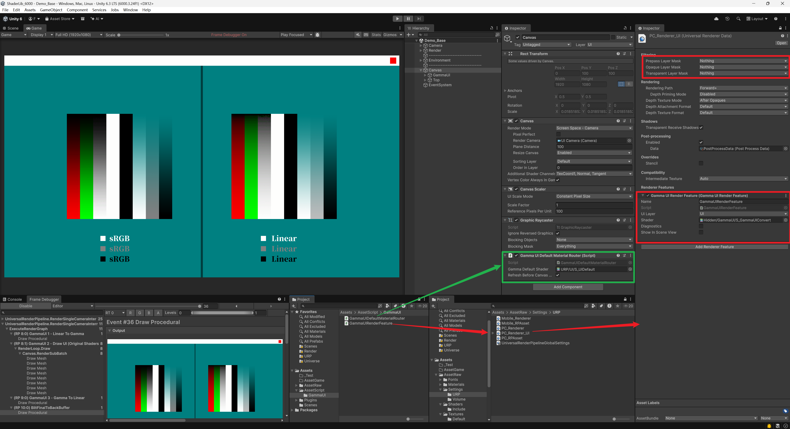
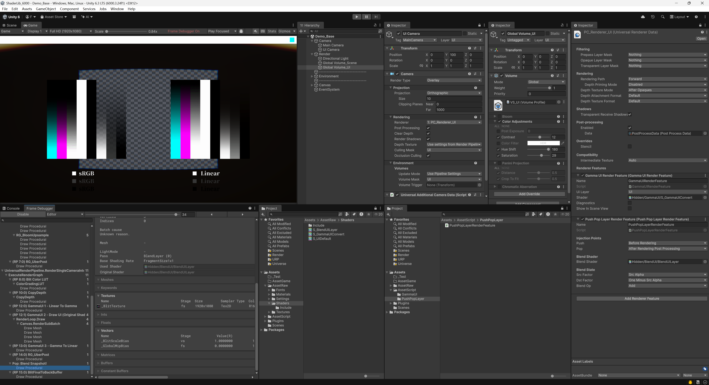
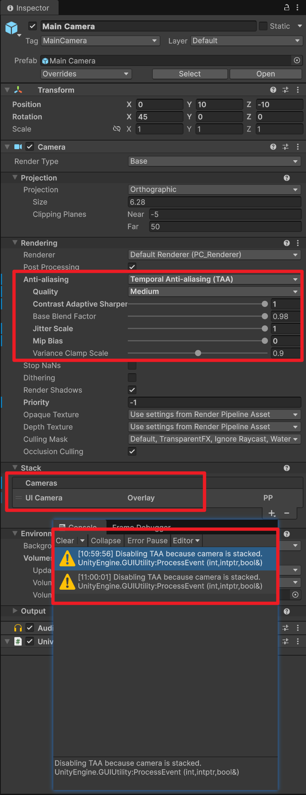
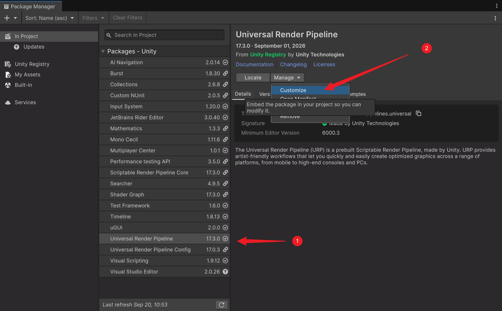

# 【ShaderLibrary_Unity 6000】


[TOC]

------

# 00 前言


------

# 01 渲染相关

## 1.1 GammaUI



* 所有的UI图片依旧保持sRGB勾选，结果是RGB依然保持原样功能，A通道始终是Gamma

* RenderFeature 中添加GammaUI

* Canvas下复写所有默认的UI材质

* 自定义UIShader自己进行色彩矫正，加到Alpha预乘前面

  ```c#
  #include "Assets/AssetRaw/Shaders/Include/SIH_GammaUI.hlsl"
  
  input.color.rgb = GammaUIEncodeIfActive(input.color.rgb);
  ```
  
  


------
## 1.2 UI 后处理与场景分离



* 添加RenderFeature

  * UI渲染之前定帧>渲染UI>后处理>混合，BeforeRendering，AfterRenderingPostProcessing
  * 混合的模式跟普通的Alpha一样，SrcApha，OneMinusSrcAlpha

* 摄像机设置，后处理设置

  * |                                   | Main Camera | UI Camera |
    | --------------------------------- | ----------- | --------- |
    | Layer（后处理物体右上角的层名称） | Default     | UI        |
    | CullingMask（渲染哪些层）         | 除了UI      | UI        |
    | VolumeMask（后处理应用哪些层）    | Default     | UI        |


------
## 1.3 UI Camera 堆栈启用 TAA

* 如果直接使用TAA会没效果以及弹警告
  

* 将URP Universal包进行本地化，否则只改Library没办法同步其他人电脑
  

* 修改两处源码

  * 将 `TemporalAA.cs` 中的检测警告注释掉

  * ```c#
    internal static string ValidateAndWarn(UniversalCameraData cameraData, bool isSTPRequested = false)
    {
        ...
    
        if (reasonWarning == null && cameraData.cameraTargetDescriptor.msaaSamples != 1)
        {
            if (cameraData.xr != null && cameraData.xr.enabled)
                reasonWarning = "because MSAA is on. MSAA must be disabled globally for all cameras in XR mode.";
            else
                reasonWarning = "because MSAA is on. Turn MSAA off on the camera or current URP Asset.";
        }
    	
        // 注释掉这一段警告Log
        // if(reasonWarning == null && cameraData.camera.TryGetComponent<UniversalAdditionalCameraData>(out var additionalCameraData))
        // {
        //     if (additionalCameraData.renderType == CameraRenderType.Overlay ||
        //         additionalCameraData.cameraStack.Count > 0)
        //     {
        //         reasonWarning = "because camera is stacked.";
        //     }
        // }
    
        if (reasonWarning == null && cameraData.camera.allowDynamicResolution)
            reasonWarning = "because camera has dynamic resolution enabled. You can use a constant render scale instead.";
    
        ...
    }
    
  * 将 `UniversalCameraData.cs` 中的开启规则进行修改，是主相机继续TAA，Overlay相机不继续TAA
  
  
  * ```c#
    internal bool IsTemporalAAEnabled()
    {
        UniversalAdditionalCameraData additionalCameraData;
        camera.TryGetComponent(out additionalCameraData);
    
        return IsTemporalAARequested()          			// Requested
            && postProcessEnabled            			    // Postprocessing Enabled
            && (taaHistory != null)                         // Initialized
            && (cameraTargetDescriptor.msaaSamples == 1)    // No MSAA
            // && !(additionalCameraData?.renderType == CameraRenderType.Overlay || additionalCameraData?.cameraStack.Count > 0)  // No Camera stack
            && additionalCameraData?.renderType != CameraRenderType.Overlay  // 当前Camera不是Overlay类型
            && !camera.allowDynamicResolution               // No Dynamic Resolution
            && renderer.SupportsMotionVectors();     	    // Motion Vectors implemented
    }
  


------

## 1.4  延迟渲染的修改

### 1.4.1 延迟渲染着色器修改框架

* 分为了全屏的 **ClusterDeferredShader** 和 **StylizedLitShader** 的 **GBufferPass**，两大块内容修改
* 增加引用（材质标记头文件、自定义灯光函数文件）
  * Assets/AssetRaw/Shaders/Include/**SIH_StylizedGBuffer.hlsl**
    * 添加自定义标记，**`kMaterialFlagStylizedLighting`**
  * Assets/AssetRaw/Shaders/Include/**SIH_StylizedLighting.hlsl**
    * 重写了 `UniversalFragmentPBR()` 为 `StylizedFragmentPBR()`，构成部分为

      * **初始化 BRDF**，`InitializeBRDFData()`
      * **准备光照信息**，`GetMainLight()`、`MixRealtimeAndBakedGI()`
      * **计算全局光照**，`GlobalIllumination()`
      * **计算主光源光照**，`lightingData.mainLightColor`+`StylizedLightingPhysicallyBased()`
      * **计算点光源光照**，`lightingData.additionalLightsColor`+`StylizedLightingPhysicallyBased()`
    * 前向渲染和延迟渲染共用的光照函数 `StylizedFragmentPBR()`，但是延迟渲染把该函数拆开使用

* 修改自定义着色器 **Stylized Lit Shader** 中的 GBuffer Pass

  * "Pass/**SIH_StylizedLitForwardPass.hlsl**"
    * `StylizedFragmentPBR()` 的前半段（**初始化 BRDF**、**准备光照信息**、**计算全局光照**）写在这
    * 末尾处增加 `output.gBuffer0.a = PackGBufferMaterialFlags(materialFlags | kMaterialFlagStylizedLighting);`
* 复制并修改延迟渲染全屏着色器 **Cluster Shader** 
  * Assets/Shaders/Deferred/**S_StylizedClusterDeferred.shader**
  * Assets/Shaders/Deferred/**SIH_StylizedClusterDeferred.hlsl**
    * `_LIT` 下增加 `StylizedLightingPhysicallyBase()` 分支
    * 通过 `((gBufferData.materialFlags & kMaterialFlagStylizedLighting) != 0u)`区分自定义的和官方的

------

### 1.4.2 添加材质标记

* 创建材质标记头文件 Assets/AssetRaw/Shaders/Include/**SIH_StylizedGBuffer.hlsl**

```c#
// 自定义材质标记：使用风格化光照
#define kMaterialFlagStylizedLighting (1u << 4)

// 官方的 GBuffer 材质标记在 GBufferCommon.hlsl 中， 使用到 1、2、4、8
// 我们的自定义材质标记 (1u << 4) 表示：整数 1，前进 4 位，得到 00010000，对应 16，等价于写 u16

/* 
 * ----------------------------------------------------------
 * 标记                                   十进制      二进制
 * kMaterialFlagReceiveShadowsOff           1        00000001
 * kMaterialFlagSpecularHighlightsOff       2        00000010
 * kMaterialFlagSpecularHighlightsOff       2        00000010
 * kMaterialFlagSubtractiveMixedLighting    4        00000100
 * kMaterialFlagSpecularSetup               8        00001000
 * kMaterialFlagStylizedLighting            16       00010000
 * ----------------------------------------------------------
 * 上面这个表格展示的是官方的 GBuffer 材质标记
 * 用二进制整数同时记录多个开关，叫做位掩码(bit mask)
 * 如果上述功能全部打开，输出的二进制为 00011111
 * ----------------------------------------------------------
 */
```

------

### 1.4.3 创建自定义光照函数 **StylizedLighting**

* xxx

```c#
xxx
```

------

### 1.4.4 修改自定义着色器 **StylizedLitShader** 中的 **GBufferPass**

* 末尾处增加 `output.gBuffer0.a` 的输出，识别

```c#
GBufferFragOutput LitGBufferPassFragment(Varyings input)
{
    ...
    
    // ---------------------------------------------------------------------
    // 核心光照计算
    // 简化版的 UniversalFragmentPBR()，自定义的为 StylizedFragmentPBR()

    // 初始化 BRDF 数据
    BRDFData brdfData;
    InitializeBRDFData(surfaceData.albedo, surfaceData.metallic, surfaceData.specular, surfaceData.smoothness, surfaceData.alpha, brdfData);

    // 准备光照信息
    Light mainLight = GetMainLight(inputData.shadowCoord, inputData.positionWS, inputData.shadowMask);
    MixRealtimeAndBakedGI(mainLight, inputData.normalWS, inputData.bakedGI, inputData.shadowMask);

    // 计算全局光照
    half3 color = GlobalIllumination(brdfData, (BRDFData)0, 0,
                                              inputData.bakedGI, surfaceData.occlusion, inputData.positionWS,
                                              inputData.normalWS, inputData.viewDirectionWS, inputData.normalizedScreenSpaceUV);
    
    // ---------------------------------------------------------------------
    // 官方的 GBuffer 输出函数
    GBufferFragOutput output = PackGBuffersBRDFData(brdfData, inputData, surfaceData.smoothness, surfaceData.emission + color, surfaceData.occlusion);
    // 自定义标记的光照模型
    output.gBuffer0.a = PackGBufferMaterialFlags(UnpackGBufferMaterialFlags(output.gBuffer0.a) | kMaterialFlagStylizedLighting);
    
    return output;
}
```

------

### 1.4.5 复制官方的延迟渲染全屏着色器 **ClusterDeferred**

* 复制 `ClusterDeferred.shader` 和 `ClusterDeferred.hlsl` 至本地，并在 Shader 中修改引用，之后就只修改 hlsl 文件
* 我存在了 `Assets/Shaders/Deferred` 这个地方，并且文件重命名为
  * `S_StylizedClusterDeferred.shader`
  * `SIH_StylizedClusterDeferred.hlsl`
* 使用 `CustomDeferredSetup.cs` 这个编辑器小工具，将官方的集群着色器改为自己的
  * 在 Project 里选中自己复制出来的 `S_StylizedClusterDeferred.shader`
  * 点击标题栏的 `Tool/CustomDeferred/使用选择的 ClusterDeferred Shader`
  * 修改完成后 git 中的 `UniversalRenderPipelineGlobalSettings.asset` 文件会进行修改，把这个上传，其它同事就会更新到了

------

### 1.4.6 修改自己的延迟渲染全屏着色器 **StylizedClusterDeferred**

* 将复制出来的 Shader 改下 include 之后，就不需要管它了，剩下的都在 hlsl 头文件中进行修改
* 在 `SIH_StylizedClusterDeferred.hlsl` 文件中，添加材质标记头和自定义灯光函数的引用
* 并使用自定义的光照函数 `StylizedLightingPhysicallyBased()`

```c#
#include "Assets/AssetRaw/Shaders/Include/SIH_StylizedGBuffer.hlsl"     // 自定义材质标记
#include "Assets/AssetRaw/Shaders/Include/SIH_StylizedLighting.hlsl"    // 自定义光照

...
    
#elif defined(_LIT)
{
  ...

    // 初始化 BRDF 数据
    BRDFData brdfData = GBufferDataToBRDFData(gBufferData);

    // 自定义标记的光照模型
    if ((gBufferData.materialFlags & kMaterialFlagStylizedLighting) != 0u)
    {
      return StylizedLightingPhysicallyBased(brdfData, light, inputData.normalWS, inputData.viewDirectionWS, materialSpecularHighlightsOff);
    }

    return half3(LightingPhysicallyBased(brdfData, light, inputData.normalWS, inputData.viewDirectionWS, materialSpecularHighlightsOff));
}
#endif
```


------

# 10 巨人的肩膀

* UI在线性空间下的Gamma矫正
  * [unity - Rendering transparent UI in Linear Color Space - Game Development Stack Exchange](https://gamedev.stackexchange.com/questions/212135/rendering-transparent-ui-in-linear-color-space)
  * https://cmwdexint.com/2019/05/30/3d-scene-need-linear-but-ui-need-gamma/
* UI后处理与场景后处理分离
  * [Fix UI Post-Processing in Unity! (Finally!) - Render Graph URP Camera Stacking Tutorial (2025)](https://www.youtube.com/watch?v=7_Vy0jDqjvM)
